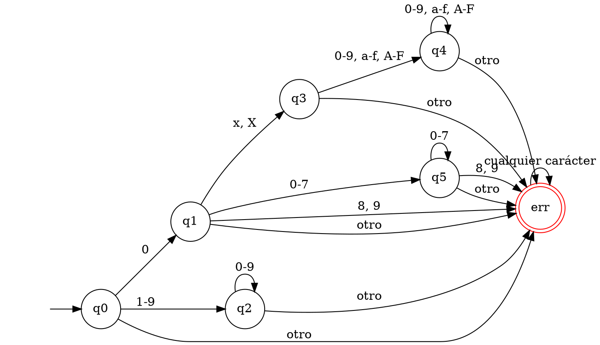
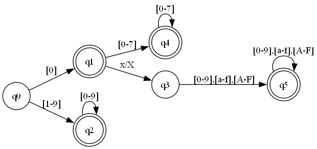

# Sintaxis y Semántica de los Lenguajes - TP #2
## Autómata Finito Determinístico para Constantes Enteras

Este proyecto implementa un programa en C que utiliza un Autómata Finito Determinístico (AFD) para validar diferentes tipos de constantes enteras: decimales, octales y hexadecimales.

El programa lee una secuencia de palabras (potenciales constantes) de un archivo de texto, separadas por comas, e indica por pantalla si cada una de ellas es una constante entera válida según la sintaxis del lenguaje C.

## Autómata Finito Determinístico (AFD)

El AFD se diseñó para reconocer las tres formas de constantes enteras:
*   **Decimal**: Una secuencia de dígitos que no comienza con `0`, o el propio `0`. Ej: `123`, `42`, `99`.
*   **Octal**: Comienza con `0` y es seguido por una secuencia de dígitos del `0` al `7`. Ej: `075`, `0123`.
*   **Hexadecimal**: Comienza con `0x` o `0X`, seguido de una secuencia de dígitos hexadecimales (`0-9`, `a-f`, `A-F`). Ej: `0x2F`, `0xB4`.

### Grafo del AFD

El siguiente grafo representa el AFD implementado en el código. Fue generado utilizando el lenguaje DOT de Graphviz.

**Código (`grafo.dot`):**

**Imagen Generada:**

### Tabla de Transiciones

La lógica del AFD está implementada mediante la siguiente tabla de transiciones, donde las filas representan el estado actual y las columnas el tipo de carácter de entrada.

| Estado  | '0' | '1'-'7' | '8'-'9' | 'x'/'X' | 'a'-'f'/'A'-'F' | Otro |
| :------ |:---:|:-------:|:-------:|:-------:|:---------------:|:----:|
| **→q0** | q1  | q2      | q2      | err     | err             | err  |
| **\*q1**| q5  | q5      | err     | q3      | err             | err  |
| **\*q2**| q2  | q2      | q2      | err     | err             | err  |
| **q3**  | q4  | q4      | q4      | err     | q4              | err  |
| **\*q4**| q4  | q4      | q4      | err     | q4              | err  |
| **\*q5**| q5  | q5      | err     | err     | err             | err  |
| **err** | err | err     | err     | err     | err             | err  |

- **→** indica el estado inicial.
- **\*** indica un estado final/de aceptación.

### Estados Finales
*   **q1**: Acepta la constante `0`.
*   **q2**: Acepta constantes decimales.
*   **q4**: Acepta constantes hexadecimales.
*   **q5**: Acepta constantes octales.
